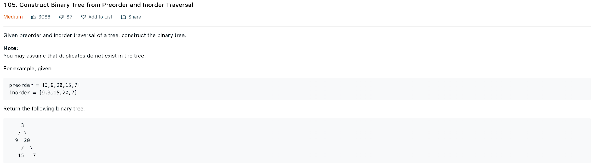
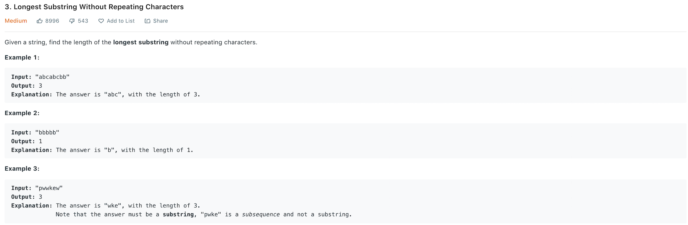
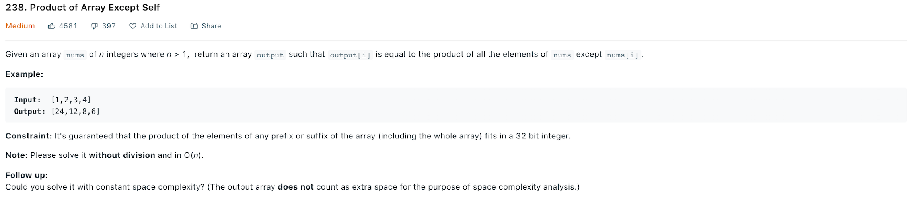
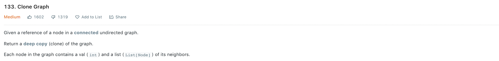
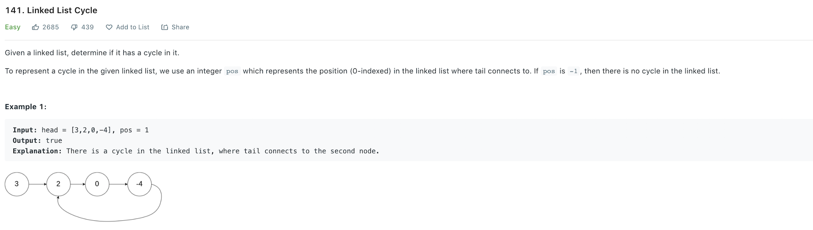
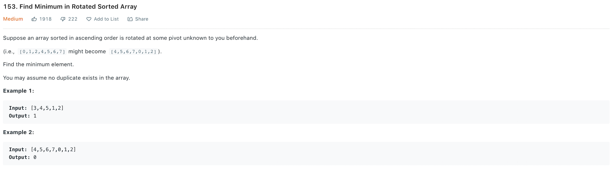
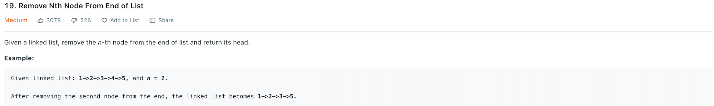
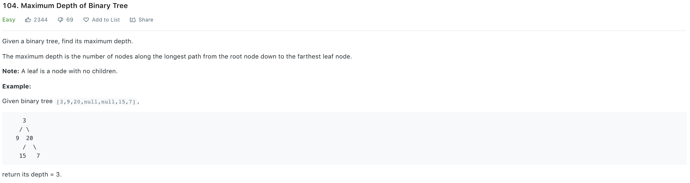
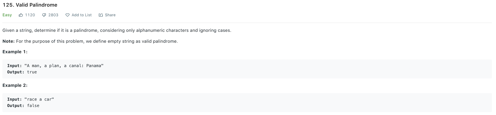

# LeetcodeQuestions
Collection of particularly interesting Leetcode questions I've come across while studying for competitive programming competitions and technical interviews.

## [Cherry Pickup II - #1463 | Difficulty: Hard](https://leetcode.com/problems/cherry-pickup-ii/)

## [Group Anagrams - #49 | Difficulty: Medium](https://leetcode.com/problems/group-anagrams/)

## [Valid Anagram - #242 | Difficulty: Easy](https://leetcode.com/problems/valid-anagram/)

## [Combination Sum IV - #377 | Difficulty: Medium](https://leetcode.com/problems/combination-sum-iv/)

## [Non-overlapping Intervals - #435 | Difficulty: Medium](https://leetcode.com/problems/non-overlapping-intervals/)

## [Contains Duplicate - #217 | Difficulty: Easy](https://leetcode.com/problems/contains-duplicate/)

## [Reorder List - #143 | Difficulty: Medium](https://leetcode.com/problems/reorder-list/)

## [Palindromic Substrings - #647 | Difficulty: Medium](https://leetcode.com/problems/palindromic-substrings/)

## [Merge k Sorted Lists - #23 | Difficulty: Hard](https://leetcode.com/problems/merge-k-sorted-lists/)

## [Find Median from Data Stream - #295 | Difficulty: Hard](https://leetcode.com/problems/find-median-from-data-stream/)

## [Word Search - #79 | Difficulty: Medium](https://leetcode.com/problems/word-search/)

## [Construct Binary Tree from Preorder and Inorder Traversal - #105 | Difficulty: Medium](https://leetcode.com/problems/construct-binary-tree-from-preorder-and-inorder-traversal/)

## [Best Time to Buy and Sell Stock - #121 | Difficulty: Easy](https://leetcode.com/problems/best-time-to-buy-and-sell-stock/)

## [Longest Substring Without Repeating Characters - #3 | Difficulty: Medium](https://leetcode.com/problems/longest-substring-without-repeating-characters/)

## [Product of Array Except Self - #238 | Difficulty: Medium](https://leetcode.com/problems/product-of-array-except-self/)

## [Clone Graph - #133 | Difficulty: Medium](https://leetcode.com/problems/clone-graph/)

## [Linked List Cycle - #141 | Difficulty: Easy](https://leetcode.com/problems/linked-list-cycle/)

## [Find Minimum in Rotated Sorted Array - #153 | Difficulty: Medium](https://leetcode.com/problems/find-minimum-in-rotated-sorted-array/)

## [Remove Nth Node From End of List - #19 | Difficulty: Medium](https://leetcode.com/problems/remove-nth-node-from-end-of-list/)

## [Maximum Depth of Binary Tree - #104 | Difficulty: Easy](https://leetcode.com/problems/maximum-depth-of-binary-tree/)

## [Valid Palindrome - #125 | Difficulty: Easy](https://leetcode.com/problems/valid-palindrome/)

